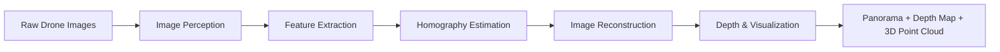

# MATLAB — Drone Image Reconstruction Engine

> **Core computational backend** responsible for taking a set of raw drone images and producing a stitched panorama, a depth map, and a 3D point cloud.

---

## Table of Contents

- [High-Level Overview](#high-level-overview)
- [Folder Structure](#folder-structure)
- [Pipeline Execution Flow](#pipeline-execution-flow)
- [Entry Point — `main.m`](#entry-point--mainm)
- [Models](#models)
  - [Image Perception](#1-image-perception-modelsimage_perception)
  - [Image Processing](#2-image-processing-modelsimage_processing)
  - [Image Rearranger](#3-image-rearranger-modelsimage_rearranger)
- [Pipeline](#pipeline)
- [Utilities](#utilities)
- [Visualization](#visualization)
- [Outputs Generated](#outputs-generated)
- [How to Run](#how-to-run)

---

## High-Level Overview

The MATLAB engine processes a directory of overlapping drone photographs through a **five-phase pipeline**:

```
Raw Images → Perception → Feature Extraction → Homography Estimation → Reconstruction → Depth & Visualization
```

Each phase maps to a dedicated sub-module inside the `models/` directory. The entire flow is orchestrated by `main.m`, which also manages logging, configuration, and output file management.



---

## Folder Structure

```
matlab/
├── main.m                          # Entry point — runs the full pipeline
├── Aerial234/                      # Sample drone image dataset (236 images)
│
├── models/                         # Core algorithms (3 sub-modules)
│   ├── image_perception/           # Phase 1: Load, preprocess, undistort
│   │   ├── loadDroneImages.m
│   │   ├── preprocessImages.m
│   │   └── distortionCorrection.m
│   │
│   ├── image_processing/           # Phase 2-3: Features, matching, depth
│   │   ├── detectFeatures.m
│   │   ├── extractDescriptors.m
│   │   ├── matchFeaturesNN.m
│   │   ├── estimateHomography.m
│   │   └── depthEstimation.m
│   │
│   └── image_rearranger/           # Phase 4: Alignment, blending, stitching
│       ├── alignImages.m
│       ├── adaptiveWarp.m
│       ├── generatePanorama.m
│       ├── multiBandBlend.m
│       └── seamSelection.m
│
├── pipeline/
│   └── reconstructionPipeline.m    # Simplified pipeline wrapper
│
├── utils/                          # Shared helper classes
│   ├── TUILogger.m
│   ├── imageUtils.m
│   └── mathUtils.m
│
└── visualization/                  # Result display functions
    ├── showPanorama.m
    ├── showDepthMap.m
    ├── showPointCloud.m
    └── showFeatureMatches.m
```

---

## Pipeline Execution Flow

When `main.m` is called, the following five phases execute sequentially:

| Phase | Name | Module | What It Does |
|-------|------|--------|-------------|
| 1/5 | **Image Perception** | `image_perception/` | Loads images, normalizes resolution/contrast, corrects lens distortion |
| 2/5 | **Feature Extraction** | `image_processing/` | Detects SURF keypoints and extracts descriptor vectors for each image |
| 3/5 | **Homography Estimation** | `image_processing/` | Matches features between consecutive pairs and computes projective transforms |
| 4/5 | **Image Reconstruction** | `image_rearranger/` | Warps all images onto a common canvas and blends them into a seamless panorama |
| 5/5 | **Depth & Visualization** | `image_processing/` + `visualization/` | Estimates relative depth via optical flow, renders panorama, depth map, and 3D point cloud |

---

## Entry Point — `main.m`

**Purpose:** Orchestrates the entire reconstruction pipeline from start to finish.

### How It Works

1. **Bootstrap** — Resolves its own location, adds all subdirectories to the MATLAB path via `addpath(genpath(...))`.
2. **Configuration** — Loads default settings (detector type, blend method, output directories) and merges any user-provided overrides.
3. **TUI Logger** — Launches a dedicated GUI log window (`TUILogger`) that shows real-time, timestamped, color-coded progress.
4. **Input Resolution** — Accepts the image directory as an argument, or opens a folder picker if none is provided.
5. **Pipeline Execution** — Calls each phase in order, logging progress and timing per phase.
6. **Output Saving** — Writes the panorama PNG, depth map PNG, and a full text log file to the `storage/` directories.
7. **Error Handling** — Wraps the entire pipeline in a `try/catch` block, logging stack traces on failure.

### Default Configuration

| Parameter | Default | Description |
|-----------|---------|-------------|
| `detector` | `'SURF'` | Feature detector algorithm (SURF, FAST, HARRIS, ORB) |
| `blendMethod` | `'multiband'` | Blending strategy (multiband or simple) |
| `enableDepth` | `true` | Whether to run the depth estimation phase |
| `maxWorkers` | `4` | Reserved for future parallel processing |
| `outputDir` | `storage/panoramas/` | Where stitched panoramas are saved |
| `depthDir` | `storage/depth_maps/` | Where depth maps are saved |
| `logDir` | `storage/logs/` | Where run logs are saved |

### Usage

```matlab
% Interactive — opens folder picker
main()

% Direct path
main('C:\drone_captures\flight_001')

% Custom configuration
main('path/to/images', struct('detector','FAST','blendMethod','simple'))
```

---

## Models

### 1. Image Perception (`models/image_perception/`)

This module handles the intake and normalization of raw drone imagery. It ensures all images are in a consistent state before any computer vision algorithms are applied.

---

#### `loadDroneImages.m`

**Purpose:** Scans a directory for image files and loads them into a cell array of pixel matrices.

**How it works:**
- Uses `dir()` to find all `.jpg` files in the specified directory.
- Loops through each file and reads it with `imread()`.
- Returns a `cell(1, N)` array where each cell contains an H×W×3 `uint8` image matrix.
- Gracefully skips unreadable files with a warning instead of crashing.

**Input:** `directoryPath` (string)  
**Output:** `images` (cell array of image matrices)

---

#### `preprocessImages.m`

**Purpose:** Normalizes all images for consistent downstream processing.

**How it works (4 steps per image):**

1. **Bit-depth normalization** — Converts `uint16` or `float` images to standard `uint8` using `im2uint8()`.
2. **Resolution standardization** — Resizes all images to match the dimensions of the first image using `imresize()`. This is critical because feature matching requires consistent pixel grids.
3. **Contrast enhancement (CLAHE)** — Converts to LAB color space, applies Contrast-Limited Adaptive Histogram Equalization (`adapthisteq`) only on the L (luminance) channel. This improves feature detection in shadowed or overexposed areas without distorting colors.
4. **Noise reduction** — Applies a mild Gaussian blur (`imgaussfilt`, σ=0.8) to suppress sensor noise while preserving edges.

**Input:** `images` (cell array of raw images)  
**Output:** `processedImages` (cell array of normalized `uint8` images)

---

#### `distortionCorrection.m`

**Purpose:** Removes radial and tangential lens distortion from each image.

**How it works:**

- **If calibration data exists** (`calibration/cameraParams.mat`): Uses MATLAB's `undistortImage()` with the stored camera intrinsics for precise correction.
- **If no calibration exists** (default path): Falls back to an adaptive parametric model:
  1. Builds a normalized coordinate grid centered on the image.
  2. Computes radial distance `R` from the center for every pixel.
  3. Applies a polynomial barrel correction: `r_corrected = r × (1 + k₁·r² + k₂·r⁴)` with `k₁ = -0.10`, `k₂ = 0.02` (typical for wide-angle drone cameras like DJI).
  4. Remaps pixel locations using bilinear interpolation (`interp2`).

**Input:** `images` (cell array of preprocessed images)  
**Output:** `correctedImages` (cell array of undistorted images)

---

### 2. Image Processing (`models/image_processing/`)

This module extracts geometric information from the images — where features are, how images relate to each other, and the relative depth of the scene.

---

#### `detectFeatures.m`

**Purpose:** A standalone, multi-algorithm keypoint detector with a unified interface.

**How it works:**
- Converts image to grayscale if needed.
- Based on the `method` argument, dispatches to one of seven MATLAB Computer Vision Toolbox detectors:
  - **SURF** (default) — Scale-invariant, robust to rotation. Best general-purpose choice.
  - **FAST** — Extremely fast corner detection, less scale-invariant.
  - **Harris** — Classic corner detector with sub-pixel accuracy.
  - **MinEigen** — Similar to Harris but uses minimum eigenvalue criterion.
  - **ORB** — Oriented FAST + rotated BRIEF. Binary descriptor, very fast.
  - **BRISK** — Multi-scale FAST with scale invariance.
  - **KAZE** — Non-linear scale space, better at blurred boundaries.

> **Note:** In the current pipeline, `extractDescriptors.m` is used instead of this file. This standalone file provides an alternative interface for experimentation.

**Input:** `img` (image matrix), `method` (string, optional)  
**Output:** `points` (feature point object)

---

#### `extractDescriptors.m`

**Purpose:** Detects keypoints and extracts their descriptor vectors in a single call. This is the function actually called by the pipeline.

**How it works:**
1. Converts the image to grayscale.
2. Runs `detectSURFFeatures()` with a metric threshold of 500 (filters out weak features).
3. Calls `extractFeatures()` to compute 64-dimensional descriptor vectors at each keypoint location.

The descriptor vectors encode the local gradient pattern around each keypoint — these are what get compared between images to find correspondences.

**Input:** `img` (drone image matrix)  
**Output:** `points` (SURFPoints object), `features` (N×64 descriptor matrix)

---

#### `matchFeaturesNN.m`

**Purpose:** Finds corresponding features between two images using nearest-neighbor matching.

**How it works:**
1. Calls MATLAB's `matchFeatures()` with `'Unique', true` (each feature matches at most one other) and `'MatchThreshold', 1.5` (strict similarity requirement).
2. Filters the original point arrays down to only the matched coordinates.

The output gives us pairs of points — "this point in image A corresponds to this point in image B" — which are the raw material for computing the geometric relationship between images.

**Input:** `features1`, `features2` (descriptor matrices), `points1`, `points2` (point objects)  
**Output:** `indexPairs` (Mx2 index matrix), `matchedPoints1`, `matchedPoints2` (matched coordinate arrays)

---

#### `estimateHomography.m`

**Purpose:** Computes the projective transformation (homography) that maps one image onto another.

**How it works:**
1. Uses `estimateGeometricTransform2D()` with the `'projective'` model and MSAC (M-estimator SAmple Consensus) — a robust variant of RANSAC.
2. Configuration: 99.9% confidence, up to 2000 random trials. This aggressively filters outlier matches.
3. Chains the new transform with the previous one: `T_cumulative = T_previous × T_step`. This builds up a chain of transforms that maps every image back to the coordinate system of the first image.

**Input:** `matchedPoints1`, `matchedPoints2` (point arrays), `previousTform` (projective2d)  
**Output:** `tform` (cumulative projective2d transformation)

---

#### `depthEstimation.m`

**Purpose:** Estimates relative depth of the scene from multiple overlapping viewpoints.

**How it works:**

1. **Pairwise optical flow** — For each consecutive image pair, computes displacement vectors using a custom block-matching algorithm:
   - Divides image 1 into 16×16 pixel blocks.
   - For each block, searches a 32-pixel radius in image 2 for the best match (minimum Sum of Squared Differences).
   - The displacement magnitude serves as a proxy for depth: larger motion = closer to camera (parallax effect).

2. **Confidence-weighted accumulation** — Each pair's disparity estimate is weighted by its confidence (normalized disparity magnitude) and accumulated.

3. **Normalization** — The accumulated disparity is normalized to [0, 1].

4. **Edge-preserving smoothing** — Applies a guided image filter (`imguidedfilter`) using the reference image as guide. This smooths flat regions while preserving sharp depth boundaries at object edges.

**Input:** `images` (cell array), `tforms` (transform vector, reserved for future use)  
**Output:** `depthMap` (H×W single-precision float, values in [0, 1])

---

### 3. Image Rearranger (`models/image_rearranger/`)

This module takes the images and their computed homographies and composites them into a single, seamless panorama.

---

#### `alignImages.m`

**Purpose:** Warps all images onto a unified global canvas using their homography transforms.

**How it works:**
1. Computes the bounding box of the output canvas by running `outputLimits()` for each transform.
2. Creates an `imref2d` spatial referencing object that defines the canvas coordinate system.
3. For each image:
   - Ensures it's RGB (converts grayscale to 3-channel if needed).
   - Calls `imwarp()` with its transform and the shared `panoramaView` to project it onto the canvas.
   - Combines with a `max()` operation (simple intensity blending).
4. Also produces a binary `mask` indicating which canvas pixels have data.

**Input:** `images` (cell array), `tforms` (projective2d vector)  
**Output:** `panorama` (RGB image on the global canvas), `mask` (logical coverage mask)

---

#### `adaptiveWarp.m`

**Purpose:** A content-aware warping function that subdivides the image into patches for better local accuracy.

**How it works:**
1. Divides the source image into an 8×8 grid of patches (with 2-pixel overlap at borders).
2. For each patch:
   - Computes a local transform adjusted for the patch offset.
   - Warps the patch independently with `imwarp()`.
   - Generates a weight mask for the warped patch.
3. Accumulates all warped patches with alpha blending and normalizes by the weight map.

This approach reduces distortion artifacts in regions far from the projection center, which is a common problem with single global projective transforms.

**Input:** `img` (source image), `tform` (projective2d), `outputView` (imref2d, optional)  
**Output:** `warpedImg` (warped image on the output canvas)

---

#### `generatePanorama.m`

**Purpose:** High-level wrapper that combines alignment, seam selection, and blending into a single call.

**How it works:**
1. Computes the output canvas dimensions from all transforms.
2. Warps every image and its mask onto the shared canvas.
3. Sequentially blends images using the selected method:
   - **Multiband:** For each overlapping region, calls `seamSelection()` to find the optimal cut line, then composites pixels from both sides of the seam.
   - **Simple:** Uses `max()` intensity blending (faster but visible seams).
4. Applies a final Gaussian blur on the composite mask edges to soften any remaining boundary artifacts.

**Input:** `images` (cell array), `tforms` (transforms), `blendMethod` (string, optional)  
**Output:** `panorama` (final stitched RGB image)

---

#### `seamSelection.m`

**Purpose:** Finds the optimal vertical seam through an overlap region using dynamic programming.

**How it works:**
1. Computes a **cost map** as the per-pixel Euclidean color difference between the two overlapping images.
2. Extracts the bounding box of the overlap region.
3. Runs **dynamic programming** from top to bottom:
   - For each pixel in a row, the cumulative cost is its own cost plus the minimum cumulative cost of its 3 neighbors (left, center, right) in the row above.
4. Traces back from the bottom row to find the minimum-cost vertical path.
5. Returns a binary mask: pixels left of the seam use image 1, pixels right use image 2.

This ensures the transition between stitched images happens along lines where the images look most similar — hiding the seam.

**Input:** `img1`, `img2` (warped images), `overlapMask` (logical)  
**Output:** `seamMask` (logical, true = use img1)

---

#### `multiBandBlend.m`

**Purpose:** A simplified blending function that softens seam boundaries.

**How it works:**
1. Detects boundary pixels in the mask using `bwmorph(mask, 'remove')`.
2. Creates a smooth alpha mask by applying a Gaussian blur (σ=15) to the binary mask.
3. Multiplies the panorama by the blurred mask, effectively feathering the edges.

> This is a lightweight alternative to full Laplacian pyramid multi-band blending.

**Input:** `panorama` (RGB image), `mask` (binary coverage mask)  
**Output:** `blendedPanorama` (RGB image with softened edges)

---

## Pipeline

### `reconstructionPipeline.m`

**Purpose:** A simplified, standalone wrapper that runs the core pipeline without the TUI logger. Useful for programmatic or batch processing.

**How it works:**
1. Loads images → preprocesses → corrects distortion.
2. Extracts features → matches them → estimates homographies.
3. Aligns and blends into a panorama.
4. Saves the result and returns a status struct.

This file is a stripped-down version of `main.m` — same algorithmic flow, but without the GUI logging, depth estimation, or visualization phases.

**Input:** `imageDir` (string), `outputDir` (string)  
**Output:** `pipelineResult` (struct with `status`, `outputFile`, `numImages`)

---

## Utilities

### `TUILogger.m`

**Purpose:** A real-time Text User Interface (TUI) log window built as a MATLAB handle class.

**How it works:**
- Creates a `uifigure` with a dark theme and monospace font.
- Provides structured logging methods:
  - `log(tag, message)` — Timestamped log entry with a padded tag (e.g., `[  12.34s]  FEATURES     Image 3/5 — extracting...`).
  - `phase(num, name)` — Prominent phase header with box-drawing characters.
  - `timing(step, seconds)` — Formatted timing output.
  - `progress(current, total, label)` — Text-based progress bar (`█░░░░`).
  - `separator()` — Visual divider line.
  - `saveLog(filePath)` — Writes all accumulated log lines to a `.log` file.
- All log entries are also echoed to the MATLAB command window via `fprintf` for headless/debugging use.

---

### `imageUtils.m`

**Purpose:** A static utility class with shared image I/O and validation helpers.

| Method | Description |
|--------|-------------|
| `validateImageFile(path)` | Checks if a file is a readable image via `imfinfo()` |
| `loadMultiFormat(dir)` | Loads images in jpg, jpeg, png, tif, tiff, bmp formats |
| `ensureRGB(img)` | Converts grayscale to 3-channel if needed |
| `toGray(img)` | Safely converts to grayscale |
| `resizeToMax(img, maxDim)` | Resizes preserving aspect ratio |
| `saveWithMetadata(img, path, meta)` | Saves image + JSON metadata sidecar file |
| `dimensions(img)` | Returns height, width, channels |

---

### `mathUtils.m`

**Purpose:** A static utility class with geometric and linear algebra helpers.

| Method | Description |
|--------|-------------|
| `computeHomographyDLT(pts1, pts2)` | Direct Linear Transform — computes 3×3 homography from ≥4 point pairs via SVD |
| `ransac(pts1, pts2, fitFn, distFn, threshold, maxIter)` | Generic RANSAC implementation for robust model fitting |
| `homographyTransferError(H, pts1, pts2)` | Symmetric transfer error for evaluating homography quality |
| `vectorAngle(v1, v2)` | Angle in degrees between two vectors |
| `rotationMatrix2D(angleDeg)` | 2×2 rotation matrix from degrees |
| `pointCloudStats(points)` | Centroid and spread of a point set |
| `normalizePoints(points)` | Centers and scales 2D points for numerical conditioning |

---

## Visualization

These functions create publication-quality figure windows for the final outputs:

### `showPanorama.m`
Opens a fullscreen figure with the stitched panorama, resolution annotation, and dark background.

### `showDepthMap.m`
Renders the depth map with the `turbo` colormap (red = near, blue = far), a labeled colorbar, and statistical annotations (mean, std, range).

### `showPointCloud.m`
Converts the depth map into a 3D point cloud:
- Projects every pixel into 3D space (x, y, depth).
- Colors points using the reference drone image.
- Downsamples for interactive performance (caps at ~500K points).
- Displays with `pcshow()` in an interactive 3D viewer with perspective projection.

### `showFeatureMatches.m`
Displays two images side-by-side with colored lines connecting matched features:
- Uses MATLAB's `showMatchedFeatures()` if available.
- Falls back to a custom rendering with HSV-colored match lines (capped at 200 for readability).

---

## Outputs Generated

After a successful run, the following files are saved:

| Output | Location | Format | Description |
|--------|----------|--------|-------------|
| **Stitched Panorama** | `storage/panoramas/panorama_YYYYMMDD_HHmmss.png` | PNG | The final stitched aerial mosaic |
| **Depth Map** | `storage/depth_maps/depth_YYYYMMDD_HHmmss.png` | PNG | Relative depth visualization |
| **Run Log** | `storage/logs/run_YYYYMMDD_HHmmss.log` | Text | Full timestamped pipeline log |

Additionally, four interactive MATLAB figure windows are opened:
1. Panorama viewer
2. Depth map visualization (colorized)
3. 3D point cloud (interactive)
4. Feature match overlay (first image pair)

---

## How to Run

```matlab
% 1. Open MATLAB and navigate to the project root
cd('C:\Users\aru\Documents\ece')

% 2. Run with the sample dataset
main('matlab/Aerial234')

% 3. Or run with your own images
main('C:\path\to\your\drone\images')

% 4. Or run with custom settings
config = struct('detector', 'FAST', 'blendMethod', 'simple', 'enableDepth', false);
main('matlab/Aerial234', config)
```

**Requirements:**
- MATLAB R2020b or later
- Computer Vision Toolbox (for `detectSURFFeatures`, `extractFeatures`, `imwarp`, etc.)
- Image Processing Toolbox (for `adapthisteq`, `imgaussfilt`, `imguidedfilter`, etc.)
